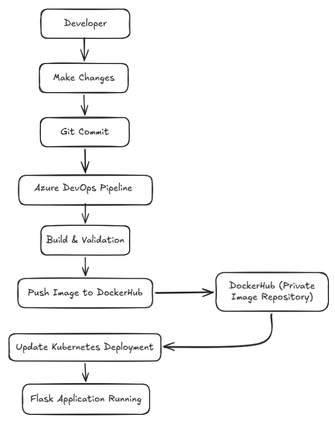

# Azure DevOps Flask CI/CD Pipeline

This project demonstrates an end-to-end multi-stage CI/CD pipeline using Flask, Docker, Kubernetes (Minikube), DockerHub, and Azure DevOps.

---

## Project Overview

The application is containerized using Docker, pushed to DockerHub, and deployed into a Kubernetes cluster running on Minikube. Azure DevOps Pipelines automates the multi-stage CI/CD workflow using a self-hosted local agent to safely test, build, and dynamically deploy the application.

This pipeline handles:  
✅ Fail-fast Build Automation  
✅ Traceable Docker Image Creation  
✅ DockerHub Push  
✅ Cloud-Native Kubernetes Dynamic Deployments  
✅ Multi-Stage Continuous Integration & Delivery Isolation  
✅ Self-Hosted Local Agent Execution  

---

## Architecture



> 💡 **Architectural Note on security and auth — local agent:** 
> This pipeline runs on a self-hosted Azure DevOps agent on the same machine as a Minikube cluster, so it uses the host's environment for authentication: a local `docker login` and the host's `kubectl` context.

## Prerequisites
* Flask App
* Docker
* Kubernetes CLI (`kubectl`)
* Minikube
* Azure DevOps Account
* GitHub Account
* DockerHub Account (Private Repository)

## Project Workflow
1. Create Dockerfile and requirements.txt
2. Build Docker image with unique build numbers
3. Push image tags to DockerHub
4. Create Kubernetes namespace and image pull secrets
5. Create and deploy deployment and service manifests
6. Configure Azure DevOps self-hosted local agent
7. Configure multi-stage Azure Pipeline YAML using `kubectl set image`
8. Trigger automated pipeline rollouts

---

## Create Dockerfile and requirements.txt

Create a `Dockerfile`:

```dockerfile
FROM python:3.13-alpine
LABEL maintainer="khalisilahk@gmail.com"
WORKDIR /mysite

# Leverage Docker layer caching for dependencies
COPY requirements.txt .
RUN pip install --no-cache-dir -r requirements.txt

COPY . .
EXPOSE 5000
CMD ["python","flask_app.py"]
```

Create 'requirements.txt'

```bash
echo "flask==3.1.0" > requirements.txt
```

## Build the Docker image:

```bash
# Start your local minikube
minikube start

# Build your image with tagging, (eg. <username>/<flask-app-name>:<tag>)
docker build -t mkbmr/my-flask-app:v1-stable.

# Verify image build
docker images | grep flask

```

## Push image to DockerHub:

```bash
# Login into Docker Account
docker login -u <username>

# Push image to dockerhub
docker push mkbmr/my-flask-app:v1
```

## Create Kubernetes Namespace and Secrets

```bash
# Create namespace
kubectl create namespace flask-app

# Apply secret to namespace
kubectl create secret docker-registry regcred \
  --docker-username='YOUR_USERNAME' \
  --docker-password="YOUR_PAT_TOKEN" \
  --docker-email='YOUR_EMAIL' \
  -n flask-app

# Verify secret
kubectl -n flask-app get secret regcred -o yaml
```

## Create & Deploy deployment and service manifests

Create your deployment.yaml and service.yaml inside deploy folder

flask-app-deployment.yaml
```bash
apiVersion: apps/v1
kind: Deployment
metadata:
  name: flask-app
  namespace: flask-app
spec:
  replicas: 3
  selector:
    matchLabels:
      components: flask-demo-app
  template:
    metadata:
      labels:
        components: flask-demo-app
    spec:
      imagePullSecrets:
        - name: regcred
      containers:
        - name: flask-demo-app
          image: mkbmr/my-flask-app:v1-stable
          imagePullPolicy: IfNotPresent
          ports:
            - containerPort: 5000
```

flask-app-service.yaml
```bash
apiVersion: v1
kind: Service
metadata:
  name: flask-demo-app-service
  namespace: flask-app
spec:
  type: LoadBalancer
  selector:
    components: flask-demo-app
  ports:
    - protocol: TCP
      port: 80
      targetPort: 5000
```


Applying both manifest
```bash
# Apply deployments
kubectl apply -f deploy/flask-app-deployment.yaml
kubectl apply -f deploy/flask-app-service.yaml

# Verify deployments
kubectl -n flask-app get pods -o wide
kubectl -n flask-app describe pod -l components=flask-demo-app
kubectl get svc -n flask-app
```

## Verify Local Network routing with Minikube
```bash
# Open another terminal tab and run minikube tunnel
minikube tunnel

# Get External IP
kubectl get svc -n flask-app

# Verify with Curl (or paste the IP and port into your web-browser)
curl -v <External-IP>:80
```

**Ensure the web application functions correctly here before proceeding to automated execution**

## Configure Azure DevOps self-hosted agent

Follow Microsoft's Official Documentation to initialize your local agent:

* [Linux agent](https://learn.microsoft.com/en-us/azure/devops/pipelines/agents/linux-agent?view=azure-devops&tabs=IP-V4)
* [macOS agent](https://learn.microsoft.com/en-us/azure/devops/pipelines/agents/osx-agent?view=azure-devops&tabs=IP-V4)
* [Windows agent](https://learn.microsoft.com/en-us/azure/devops/pipelines/agents/windows-agent?view=azure-devops&tabs=IP-V4)

**Ensure your agent pool indicates an `online` status before triggering the configuration block below.**


## Create Azure Pipeline YAML

The declarative multi-stage Azure DevOps pipeline separates Continuous Integration (CI) from Continuous Delivery (CD) to manage builds dynamically without mutating physical files via scripts, ensuring resilience against configuration drift.

```bash
trigger:
  - main

pool:
  name: Agents

stages:
  - stage: CI_Stage
    displayName: "Build and Package"
    jobs:
      - job: BuildJob
        steps:
          - task: CmdLine@2
            displayName: "Syntax check"
            inputs:
              script: python -m py_compile flask_app.py

          - task: CmdLine@2
            displayName: "Build Docker Image"
            inputs:
              script: docker build -t mkbmr/my-flask-app:$(Build.BuildNumber) .

          - task: CmdLine@2
            displayName: "Push Image to DockerHub"
            inputs:
              script: docker push mkbmr/my-flask-app:$(Build.BuildNumber)

  - stage: CD_Stage
    displayName: "Deploy to Minikube"
    dependsOn: CI_Stage
    condition: succeeded()
    jobs:
      - job: DeployJob
        steps:
          - task: CmdLine@2
            displayName: "Update Manifest and Deploy"
            inputs:
              script: |
                set -e
                kubectl get namespace flask-app || kubectl create namespace flask-app
                kubectl apply -f deploy/flask-app-service.yaml -n flask-app
                kubectl apply -f deploy/flask-app-deployment.yaml -n flask-app

                # Update image dynamically
                kubectl set image deployment/flask-app flask-demo-app=mkbmr/my-flask-app:$(Build.BuildNumber) -n flask-app

                # Verify health
                kubectl rollout status deployment/flask-app -n flask-app --timeout=60s
```

## Trigger Automated Pipeline

Commit and push changes to `flask_app.py` or your frontend files in the `templates/` folder. Azure DevOps will automatically invoke the stages, update the running container image via the cluster API, and smoothly switch traffic over to the healthy pods.

## Day-2 Operations & Cluster Management

### Managing Scaling Demands

To modify horizontal scaling manually via CLI:

```bash
# Scaling up the target deployment to 5 active replicas
kubectl scale deployment/flask-app --replicas=5 -n flask-app

# Watch the pods spinning up in real-timeout
kubectl get pods -n flask-app -w
```

### Executing Instant Rollbacks

If image are broken or corrupted, executing a rollback to the last working image

```bash
# Check history of rolling deployment revisions
kubectl rollout history deployment/flask-app -n flask-app

# Revert to last working image
kubectl rollout undo deployment/flask-app -n flask-app

# Confirm rollback completes health check successfully
kubectl rollout status deployment/flask-app -n flask-app
```

## Troubleshooting

### ImagePullBackOff

* Incorrect DockerHub credentials in the target namespace
* Missing or misconfigured Kubernetes pull secret (regcred)
* Typos in the repository prefix or tag formatting

### CrashLoopBackOff

* Core Python runtime bugs or failures inside `flask_app.py`
* Missing context dependencies within `requirements.txt`
* Discrepancies between internal and external container's binding `EXPOSE`

```bash
# Get all pod
kubectl get pods -n flask-app

# Image/loopback issues
kubectl -n flask-app describe pod -l components=flask-demo-app

# See pod's logs
kubectl logs <pod-name> -n flask-app
```

## Future Improvements
* GitHub Actions Portability: Implementing GitHub Actions
* Secure Secret Management: Using service tokens as pipeline secrets
* GitOps: Switch to Helm/Kustomize and let ArgoCD/Flux sync the cluster
* Shift-left Sec: Run Trivy for security linting

## Author

Khalis Ruzli
